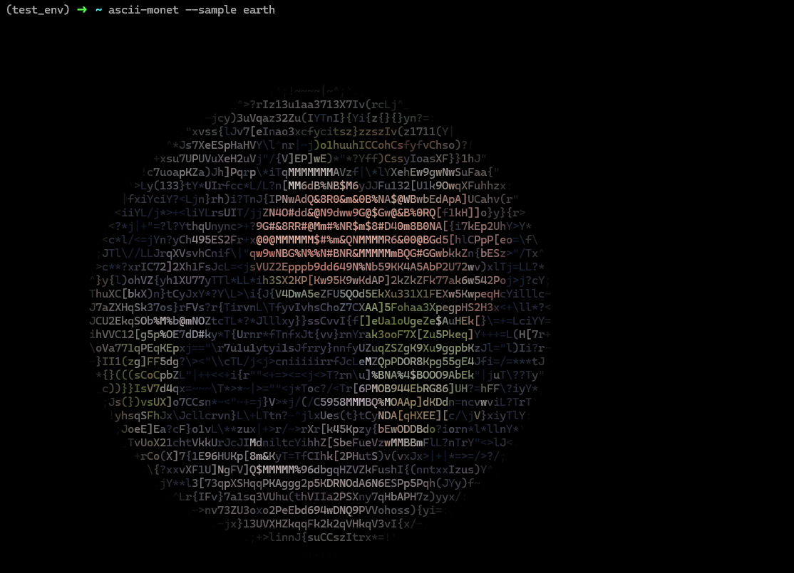

# Ascii Monet!

Command line utility for converting images into ascii-art! Works best in a terminal with a dark background.

Unfortunately, the images don't look great in Windows PowerShell because the darks aren't dark enough (??). But looks nice in Linux, WSL and CMD. 

## Install

Package is available on PyPi. Install with:

`pip install ascii-monet`

## Usage

* Use one of the sample images: `ascii-monet --sample <IMAGE>`
* Or pass in the path to an image: `ascii-monet <IMAGE_PATH>`

