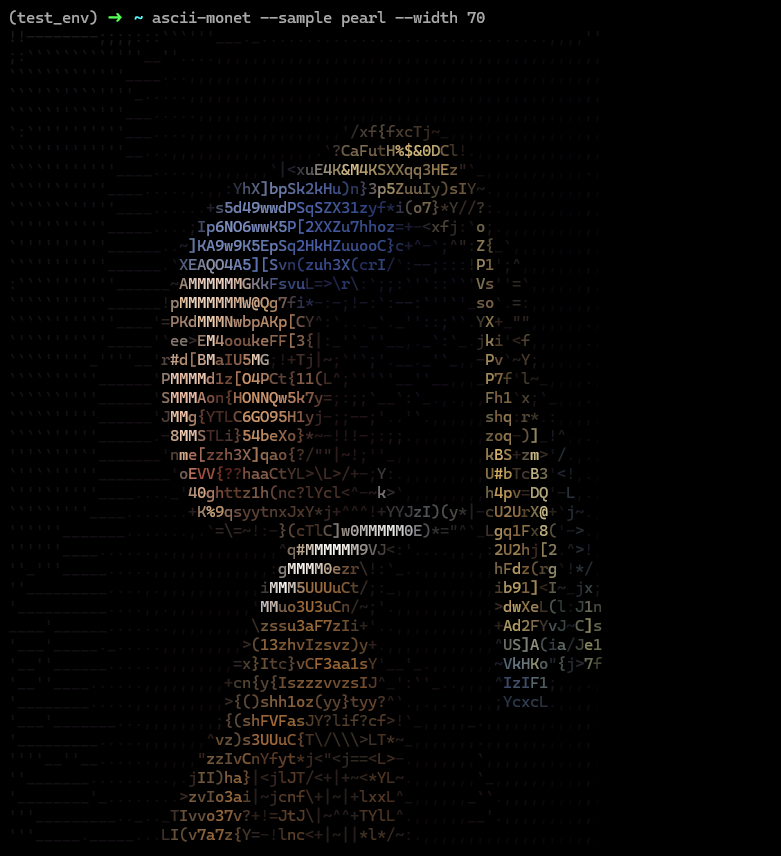
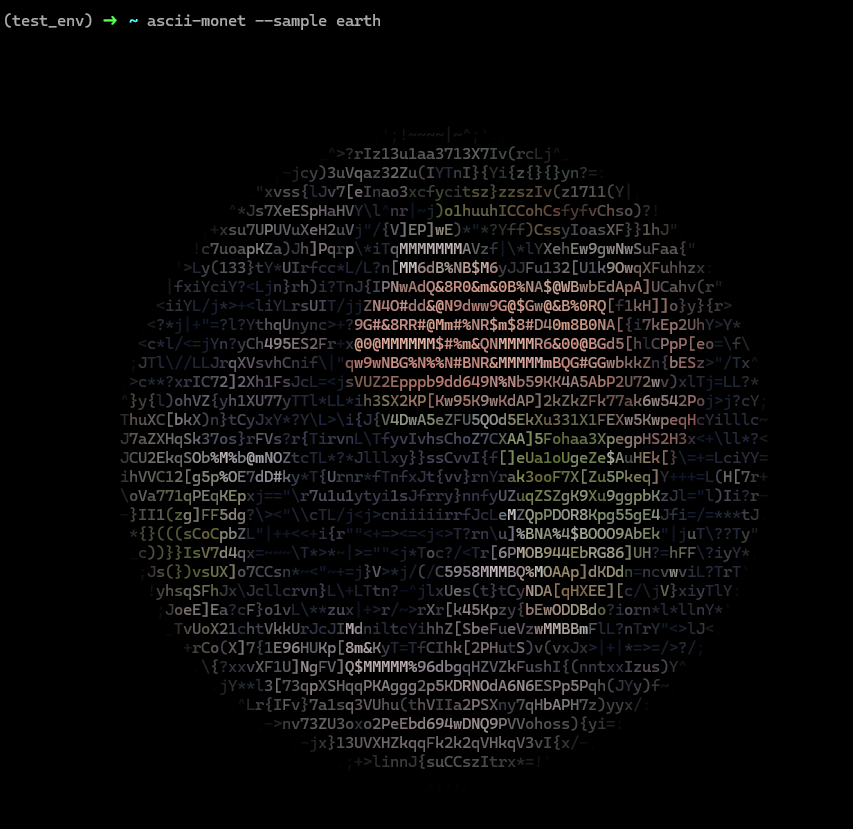
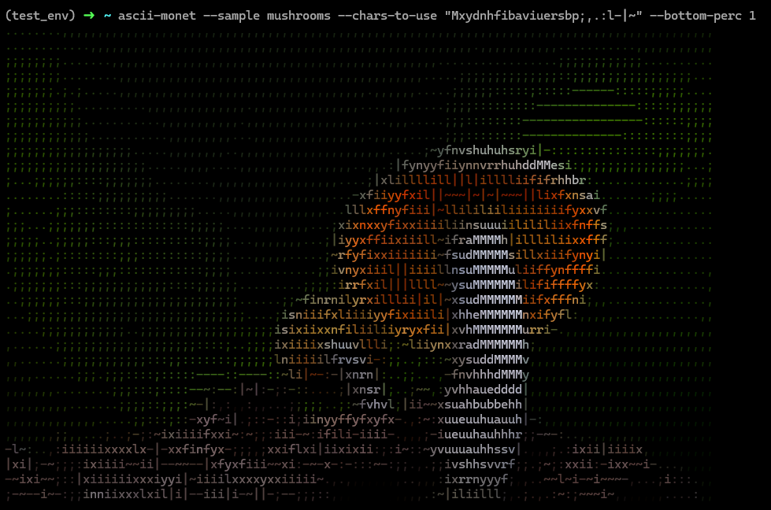
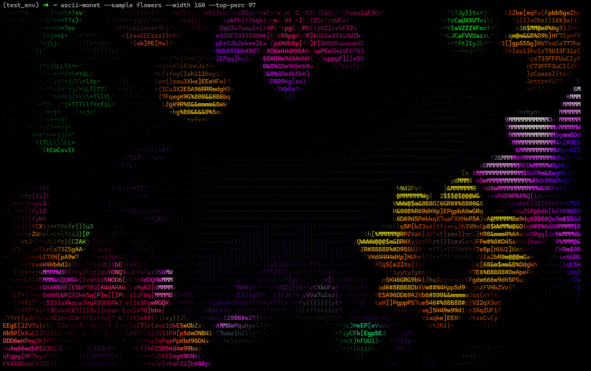
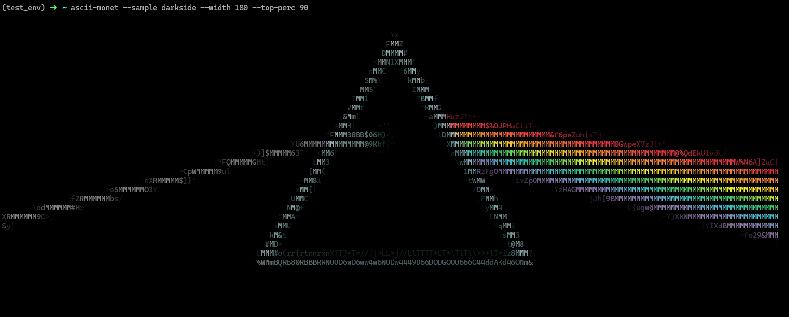

# Ascii Monet!

Command line utility for converting images into ascii-art! Works best in a terminal with a dark background.

Unfortunately, the images don't look great in Windows PowerShell because the darks aren't dark enough (??). But looks nice in Linux, WSL and CMD. 

## Install

Package is available on PyPi (https://pypi.org/project/ascii-monet/). Install with:

`pip install ascii-monet`

## Usage

#### Basic usage:

* Use one of the sample images: `ascii-monet --sample <IMAGE>`
* Or pass in the path to an image: `ascii-monet <IMAGE_PATH>`

#### Useful commands:
- `--width` Give width in chars (eg. 100)
- `--terminal-width` Makes images width of terminal
- `-chars-to-use` Explicitly chose which characters to use
- `--top-perc` Modify high end of luminance range, uses more or fewer chars for the bright areas

## Examples

Each of the following examples are available by default via the `--sample` command.

### Earth!

### Mushrooms!

### Flowers!

### Dark Side of the Moon

## Issues

- Height command not working properly
- True grayscale images (with shape [W, H] instead of [W, H, 3]) not working
- Images with alpha channel not working (shape [W, H, 4])
- Not working properly in VSCode integrated terminal and Windows Terminal running Windows Powershell: darks not dark enough
